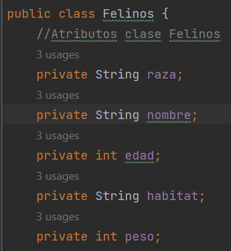
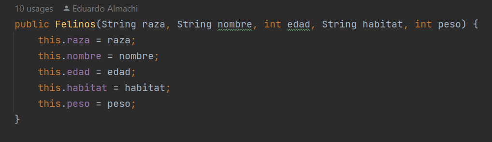
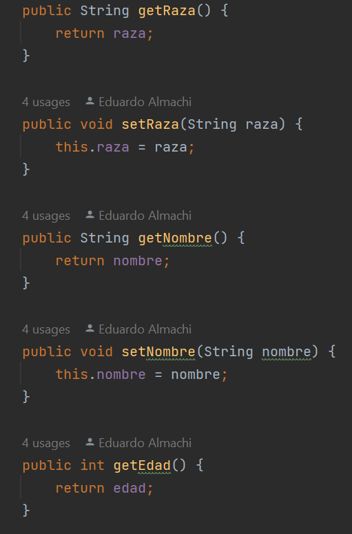
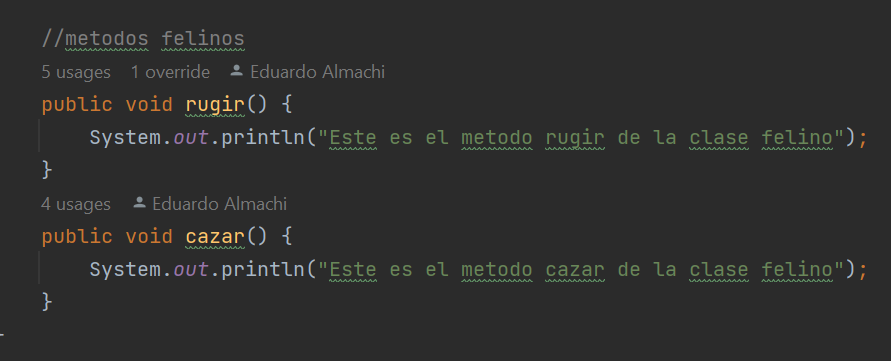

## Deber Herencias POO

### Nombre: Eduardo Almachi

- Este programa cuenta de dos partes :
    - La superclase y sus clases hijas
    - Y el main con el menu para setear los objetos

# Herencia-Felinos y sus clases hijas
En este código, la clase Felinos representa una entidad genérica de felinos con los atributos comunes como la raza, el nombre, la edad, el hábitat y el peso.

El constructor Felinos se utiliza para inicializar los atributos de la clase con los valores proporcionados al crear un objeto Felinos.

Los métodos getter y setter se utilizan para acceder y modificar los valores de los atributos raza, nombre, edad, habitat y peso.

Además, la clase Felinos contiene los métodos rugir() y cazar(), que son comportamientos comunes de los felinos. Estos métodos simplemente imprimen mensajes en la consola.

En resumen, la clase Felinos sirve como una base genérica para representar a diferentes tipos de felinos y proporciona los métodos para acceder y modificar sus atributos, así como para realizar acciones específicas de los felinos, como rugir y cazar.

# Resultado del programa
El programa muestra un menú interactivo en el que el usuario puede seleccionar diferentes opciones relacionadas con distintos tipos de felinos: Leopardo, Gato, León y Tigre. Cada opción permite al usuario ingresar datos específicos para crear instancias de objetos de las respectivas clases.

El programa utiliza un bucle do-while para mantener el menú en pantalla hasta que el usuario seleccione la opción "SALIR" (opción 5). Dentro del bucle, se muestra el menú principal y se solicita al usuario que ingrese una opción.

Dependiendo de la opción seleccionada, se ejecuta un bloque de código correspondiente a cada tipo de felino. Para cada tipo de felino, se solicitan datos específicos al usuario, como la raza, el nombre, la edad, el hábitat, el peso y otros atributos particulares de cada especie.

Después de que se ingresen los datos, se llaman a los métodos imprimirleopardo(), imprimirgato(), imprimirleon(), imprimirtigre() respectivamente para imprimir los datos del felino correspondiente en la consola.

El bucle continuará hasta que el usuario seleccione la opción "SALIR" (opción 5), momento en el cual el programa finalizará.

