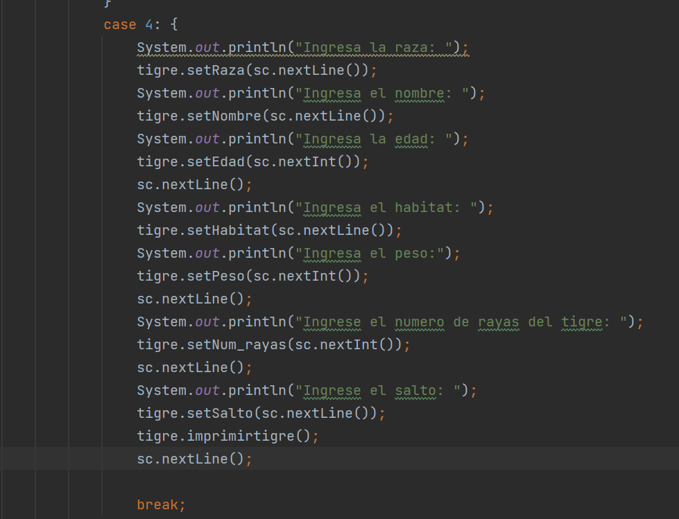
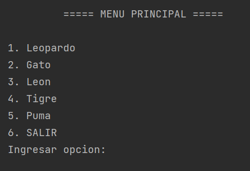

## Deber Herencias

### Nombre: Eduardo Almachi

# Herencia-Felinos

El programa muestra un menú interactivo en el que el usuario puede seleccionar diferentes opciones relacionadas con distintos tipos de felinos: Leopardo, Gato, León y Tigre. Cada opción permite al usuario ingresar datos específicos para crear instancias de objetos de las respectivas clases.

El programa utiliza un bucle do-while para mantener el menú en pantalla hasta que el usuario seleccione la opción "SALIR" (opción 5). Dentro del bucle, se muestra el menú principal y se solicita al usuario que ingrese una opción.

Dependiendo de la opción seleccionada, se ejecuta un bloque de código correspondiente a cada tipo de felino. Para cada tipo de felino, se solicitan datos específicos al usuario, como la raza, el nombre, la edad, el hábitat, el peso y otros atributos particulares de cada especie.

Después de que se ingresen los datos, se llaman a los métodos imprimirleopardo(), imprimirgato(), imprimirleon(), imprimirtigre() respectivamente para imprimir los datos del felino correspondiente en la consola.

El bucle continuará hasta que el usuario seleccione la opción "SALIR" (opción 5), momento en el cual el programa finalizará.
